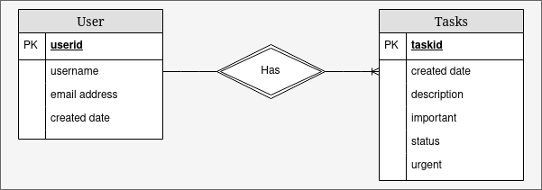

# API
The same API surface is written in two different languages.  Here are some interesting differences:
| Language | Framework | Lines of Code | Dependencies | URL      |
| -------- | --------- | ------------- | ------------ | -------- |
| NodeJS   | Express   | x             | x            | https:// |
| Python   | Chalice   | x             | x            | https:// |

## NodeJS
The Node version uses [Express](https://expressjs.com/), a fast, unopinionated, minimalist web framework.

## Python
The Python version uses [Chalice](https://aws.github.io/chalice/index), a serverless microframework for running Python in AWS Lambda.

## Why?
When implementing the same thing across languages, it's easier to see the strengths and weaknesses of each.

# Data
The data store is [Amazon DynamoDB](https://aws.amazon.com/dynamodb/).  This document database requires upfront thought to consider data access patterns.

## Entity Relationship Diagram

## Access Patterns
The table below captures the ways our application will access our data:

| Access pattern                              | Index     | Parameters | Notes       |
| ------------------------------------------- | --------- | ---------- | ----------- |
| Create task                                 | primary   | userid     | transaction |
| Get single task                             | primary   | taskid     | transaction |
| Update single task                          | primary   | taskid     | transaction |
| Delete task                                 | primary   | taskid     | transaction |
| Get all tasks                               | primary   | userid     | listview    |
| Get important, urgent tasks                 | secondary | userid     | quadrant 1  |
| Get important, non-urgent tasks             | secondary | userid     | quadrant 2  |
| Get urgent, unimportant tasks               | secondary | userid     | quadrant 3  |
| Delete urgent, unimportant tasks (manual)   | secondary | userid     | quadrant 3  |
| Get non-urgent, unimportant tasks           | secondary | userid     | quadrant 4  |
| Delete non-urgent, unimportant tasks (time) | secondary | userid     | quadrant 4  |

## Entity Chart
| Entity | PartitionyKey | SortKey | GSI 1     | GSI 2  |
| ------ | ------------- | ------- | --------- | ------ |
| Users  | userid        | userid  | n/a       | n/a    |
| Tasks  | userid        | taskid  | important | urgent |

