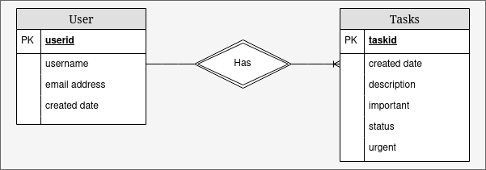

# Data
The data store is [Amazon DynamoDB](https://aws.amazon.com/dynamodb/).  This document database requires upfront thought to consider data access patterns.

## Entity Relationship Diagram


## Access Patterns
The table below captures the ways our application will access our data:

| Access pattern                              | Index     | Parameters | Notes       |
| ------------------------------------------- | --------- | ---------- | ----------- |
| Create task                                 | primary   | userid     | transaction |
| Get single task                             | primary   | taskid     | transaction |
| Update single task                          | primary   | taskid     | transaction |
| Delete task                                 | primary   | taskid     | transaction |
| Get all tasks                               | primary   | userid     | listview    |
| Get important, urgent tasks                 | secondary | userid     | quadrant 1  |
| Get important, non-urgent tasks             | secondary | userid     | quadrant 2  |
| Get urgent, unimportant tasks               | secondary | userid     | quadrant 3  |
| Delete urgent, unimportant tasks (manual)   | secondary | userid     | quadrant 3  |
| Get non-urgent, unimportant tasks           | secondary | userid     | quadrant 4  |
| Delete non-urgent, unimportant tasks (time) | secondary | userid     | quadrant 4  |

## Entity Chart
| Entity | PartitionyKey | SortKey | GSI 1     | GSI 2  |
| ------ | ------------- | ------- | --------- | ------ |
| Users  | userid        | userid  | n/a       | n/a    |
| Tasks  | userid        | taskid  | important | urgent |

## Object Schema
Each task has the following schema in Python:
```python
{
  "description": {"type": "str"},
  "important": {"type": "bool"},
  "status": {"type": "str", "enum": ["todo", "inprogress", "complete"]},
  "taskid": {"type": "str"},
  "urgent": {"type": "bool"},
  "username": {"type": "str"}
}
```

# Development
## Setup
1. Create a new virtualenv

```bash
python3 -m venv chalice-env
```

2. Activate the virtualenv

```bash
source chalice-env/bin/activate
```

3. Install chalice and other dependencies 

```bash
pip install -r requirements.txt
```

## Testing
All tests assume you have [httpie](https://httpie.io/) installed (```pip install httpie```).  Try the basic API url with:

```bash
http $(chalice url)
```

You can run locally using:

```bash
chalice local
```